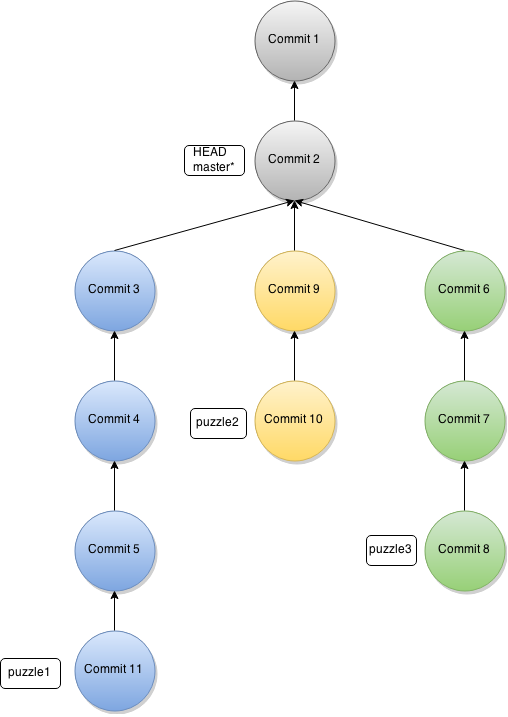
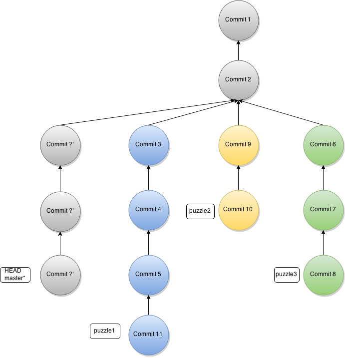

== git cherry-pick tutorial

This repo covers one of the git commands called http://git-scm.com/docs/git-cherry-pick[cherry-pick] by giving a small task simply letting you to fulfil the goal of this tut.

`git cherry-pick` basically enables you to _copy_ series of commits under your current location to which the HEAD referred.

.basic git cherry-pick command
[source,bash]
----
$ git cherry-pick commit1 commit2 commit3 ... commitN <1>
----
<1> Each commit refers to a SHA-1 hash value. Note that giving only the first seven characters (i.e. `ab8s001`) of an hash value in the command is plausible. 

In case your cherry-pick command get failure while copying one of the specified commits in the command (e.g. when a conflict occurs ), you can use the commands below to continue/quit/abort the next targeted commit(s) later on.

[source,bash]
----
git cherry-pick --continue
git cherry-pick --quit
git cherry-pick --abort
----

== Task

Answer the three given questions, each of which is a description message of a commit in which an ASCII image located, and copy those images (they are located in different asciidoc files) by using `git cherry-pick` below the master branch (`HEAD`). Figure 1 illustrates the current workflow of this repo.

.The current commits flow

The following questions will give you the locations (i.e. commits) of the ASCII images:

. What is the name of the GitHub mascot?
. What is the name of the Linux mascot?
. What is the name of the mascot of Java?

After obtaining the answers, you need to traverse all the commits using either Git or GitHub services to find the related commits and their hash values. 

At last, you will end up with the new flow in your local machine likewise carry out the task. The figure below is an example of the expected flow showing what happens when cherry-picking the targeted commits:

== License 

https://creativecommons.org/publicdomain/zero/1.0/[Creative Commons Zero]

